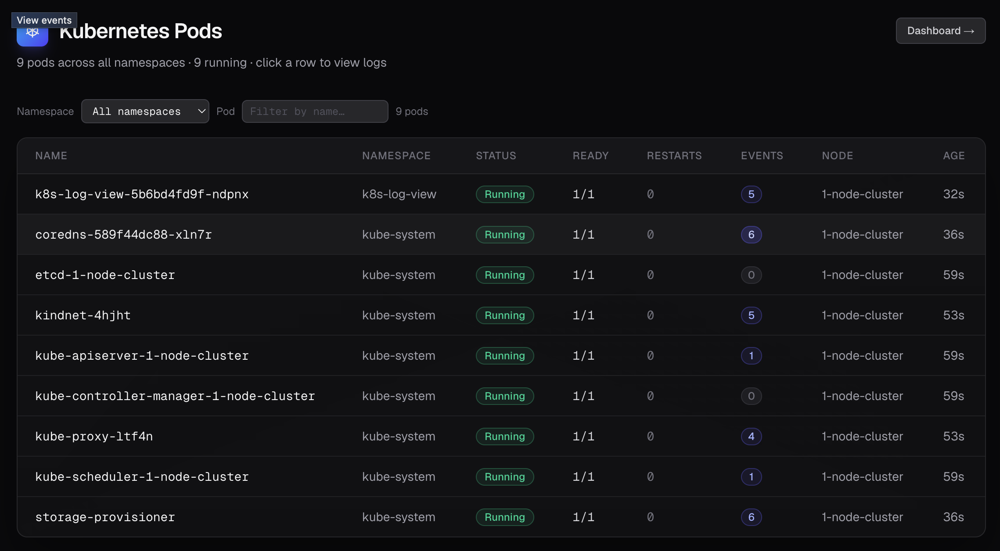
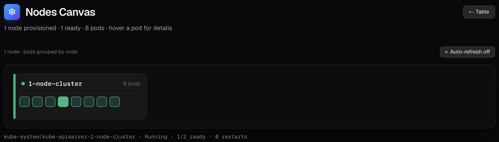
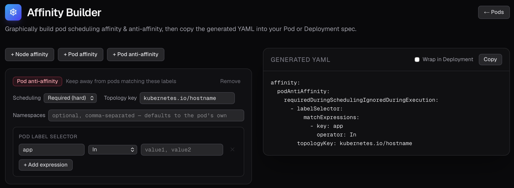
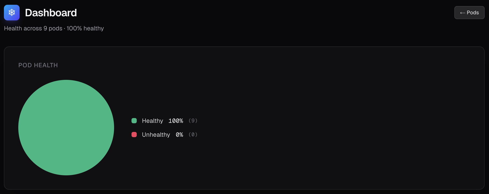

# K8s LogView

## What exactly is K8s LogView and what are its capabilities?

K8s LogView is a tool for viewing k8s pod logs and events.
It is comparable to what we see when executing the commands:
* ```kubectl logs <podname> -n <namespace>``` for getting the logs of a certain container in the k8s pod,
* ```kubectl logs <podname> --previous -n <namespace>``` for getting the logs of the previous instance of a container,
* ```kubectl -- events for pod/<podname> -n <namespace>``` that show the events that occured during the pod init and start up phases






## What is the Use Case for K8s LogView?

* It is meant to be installed directly in the K8s cluster.
* It is not a replacement of enterprise-grade monitoring tools!
* It is rather a *lightweight* tool that allows for quick lookup of the logs and events, enabling users who are not that familiar with kubectl or limited due to permission boundaries in the K8s cluster.
* It is mainly a tool for "read-only".

## TechStack and installation

* NextJS + React + Typescript

### Local Run

```
npm ci
npm run dev # for local testing, e.g., with minikube

npm run build && npm run start # when ready to package the application
```

### Install on K8s Cluster
Use [this K8s-Log-View Helm Chart](https://github.com/dennissobczak/helmchart-k8s-log-view)
